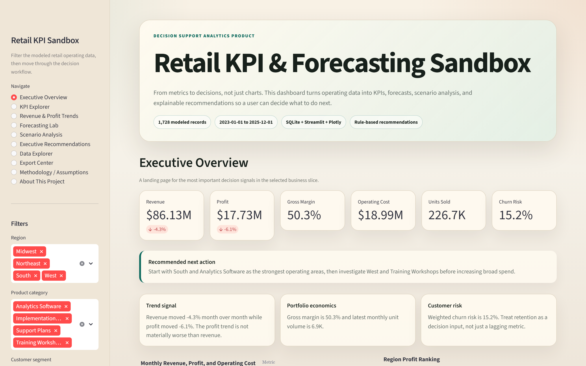

# Decision Intelligence Lab

Streamlit analytics sandbox for KPI review, scenario testing, forecast ranges, exports, and recommendation logic. The project uses modeled sample data so the workflow is reproducible and safe to review publicly.

- Narrated walkthrough: [`assets/demo/narrated-demo.mp4`](assets/demo/narrated-demo.mp4)
- Validation notes: [`docs/PORTFOLIO_PROOF.md`](docs/PORTFOLIO_PROOF.md)
- Methodology: [`docs/METHODOLOGY.md`](docs/METHODOLOGY.md)

## Overview

Decision Intelligence Lab demonstrates how I structure an analytics product from data through explanation: load modeled operating records, calculate KPIs, expose scenario controls, generate forecast ranges, and keep recommendation evidence visible.

The project is a portfolio analytics sandbox. It does not claim to forecast a real business or represent a real company.

## Problem

Dashboards often show metrics without making the calculation path or recommendation logic reviewable. This project makes the decision workflow inspectable: data source, calculations, scenario assumptions, recommendation evidence, and limitations are all documented.

## What I Built

- A Streamlit app with executive overview, KPI explorer, trend views, forecasting lab, scenario analysis, recommendation cards, data explorer, and export center.
- A modeled dataset with 1,728 operating records for repeatable analysis.
- SQLite setup and SQL scripts for local analytical storage.
- KPI, forecasting, scenario, recommendation, and report-export modules.
- pytest coverage for calculation and recommendation logic.
- Public-safe screenshots, WebM, GIF, and narrated MP4 walkthrough assets.

## Evidence

| Evidence | Location |
| --- | --- |
| Validation checklist | [`docs/PORTFOLIO_PROOF.md`](docs/PORTFOLIO_PROOF.md) |
| Data dictionary | [`docs/data_dictionary.md`](docs/data_dictionary.md) |
| Architecture notes | [`docs/architecture.md`](docs/architecture.md) |
| Business use case | [`docs/business_use_case.md`](docs/business_use_case.md) |
| Methodology | [`docs/METHODOLOGY.md`](docs/METHODOLOGY.md) |
| Tests | [`tests/`](tests/) |
| Demo assets | [`assets/demo/`](assets/demo/) |

## Demo / Screenshots

Demo assets are generated from the included modeled dataset.



Additional captures:

- [`assets/demo/kpi-explorer.png`](assets/demo/kpi-explorer.png)
- [`assets/demo/forecasting-lab.png`](assets/demo/forecasting-lab.png)
- [`assets/demo/scenario-analysis.png`](assets/demo/scenario-analysis.png)
- [`assets/demo/executive-recommendations.png`](assets/demo/executive-recommendations.png)
- [`assets/demo/data-explorer.png`](assets/demo/data-explorer.png)
- [`assets/demo/demo.webm`](assets/demo/demo.webm)
- [`assets/demo/demo.gif`](assets/demo/demo.gif)
- [`assets/demo/narrated-demo.mp4`](assets/demo/narrated-demo.mp4)

Regenerate media:

```powershell
.\.venv\Scripts\python.exe -m playwright install chromium
.\.venv\Scripts\python.exe scripts\capture_decision_lab_media.py
```

## Tech Stack

- Python
- Streamlit
- Pandas
- SQLite
- Plotly
- pytest
- Playwright media capture

## Architecture

```text
app.py                         Streamlit app entrypoint
src/kpi_engine.py              KPI calculations
src/forecasting.py             Forecast range helpers
src/scenario_engine.py         Scenario controls and impact logic
src/recommendation_engine.py   Explainable recommendation rules
src/report_exporter.py         CSV and Markdown export helpers
scripts/setup_database.py      SQLite setup
scripts/capture_decision_lab_media.py
tests/                         Calculation and export tests
docs/                          Methodology and validation notes
assets/demo/                   Screenshots and walkthroughs
```

## Data Source

The repository includes modeled sample business data for reproducibility. It is not private company data and should not be read as market or operational evidence from a real organization.

## Data Limitations

- Forecasts are directional examples.
- Recommendations demonstrate logic and evidence framing.
- Outputs are not business advice.

## Setup

```powershell
py -3.12 -m venv .venv
.\.venv\Scripts\python.exe -m pip install -r requirements.txt
.\.venv\Scripts\python.exe scripts\setup_database.py
```

## Environment Variables

No secrets are required.

## How To Run

```powershell
.\.venv\Scripts\python.exe -m streamlit run app.py
```

## Tests

```powershell
.\.venv\Scripts\python.exe -m pytest
```

## Security / Privacy Notes

- Public history is clean release history.
- Included data is modeled sample data.
- No credentials, local-only working notes, non-project communications, or private datasets are included.
- Demo media is generated from the public-safe local app path.

## Roadmap

- Add a short written walkthrough for each dashboard tab.
- Add CI for tests and media-link validation.
- Add additional scenario examples while keeping source assumptions explicit.

## License

MIT License. See [`LICENSE`](LICENSE).
